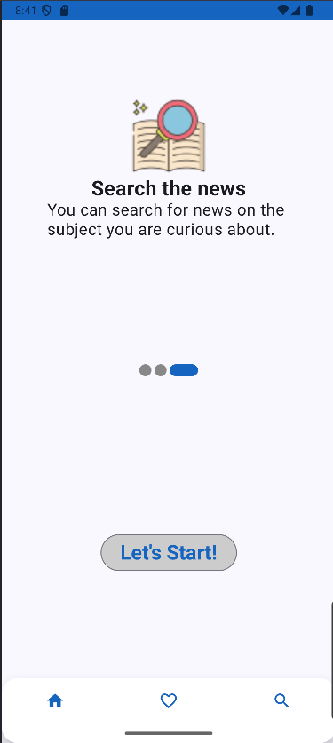
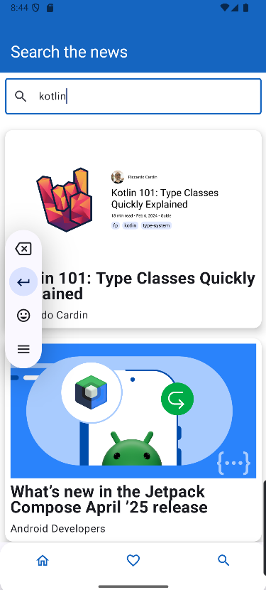

# 📰 NewsAppJetpackCompose

Jetpack Compose ile geliştirilmiş modern haber uygulamasıdır. Uygulama, güncel yazılım mimarisi ve popüler Android teknolojileri kullanılarak inşa edilmiştir.

---

## 🚀 Özellikler (Features)

- 🧱 **Jetpack Compose**: Tamamen Compose ile yazılmış modern UI.
- 🧠 **MVVM Mimarisi**: ViewModel, Repository ve DataSource katmanları ile temiz bir yapı.
- 💾 **Room Database**: Verilerin yerel olarak saklanmasını sağlar.
- 🌐 **Retrofit**: Haber verilerini API üzerinden çekmek için kullanıldı.
- 🧭 **Navigation Component**: Ekranlar arası geçişler `Navigation` ile sağlandı. Serializable yapısıyla veri taşındı.
- 🔁 **MutableStateOf**: UI durumlarını kontrol etmek için kullanıldı.
- 🔐 **Dagger-Hilt**: Bağımlılık enjeksiyonu için kullanıldı.
- 🌍 **WebView**: Haber detaylarında orijinal haber sayfasına yönlendirme.
- ❤️ **Favoriler**: Haberleri favorilere ekleyebilme.
- 🔎 **Arama Özelliği**: Anahtar kelimeye göre haber arama.

---

## 📸 Ekran Görüntüleri

| Splash | Onboarding 1 | Onboarding 2 | Onboarding 3 |
|:--:|:--:|:--:|:--:|
|  |  |  |  |

| Home Screen | Detail Screen | WebView Screen | Favorites Screen |
|:--:|:--:|:--:|:--:|
|  |  |  |  |

| Search Screen |  |  |  |
|:--:|:--:|:--:|:--:|
|  |  |  |  |

---

## 🛠️ Kullanılan Teknolojiler

- **Kotlin**
- **Jetpack Compose**
- **MVVM Architecture**
- **ViewModel**
- **Repository Pattern**
- **Room**
- **Retrofit**
- **Navigation with Serializable**
- **Dagger-Hilt**
- **WebView**

---
